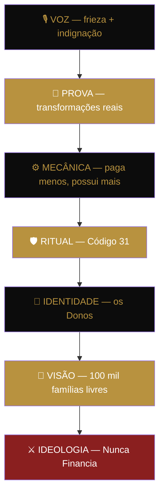
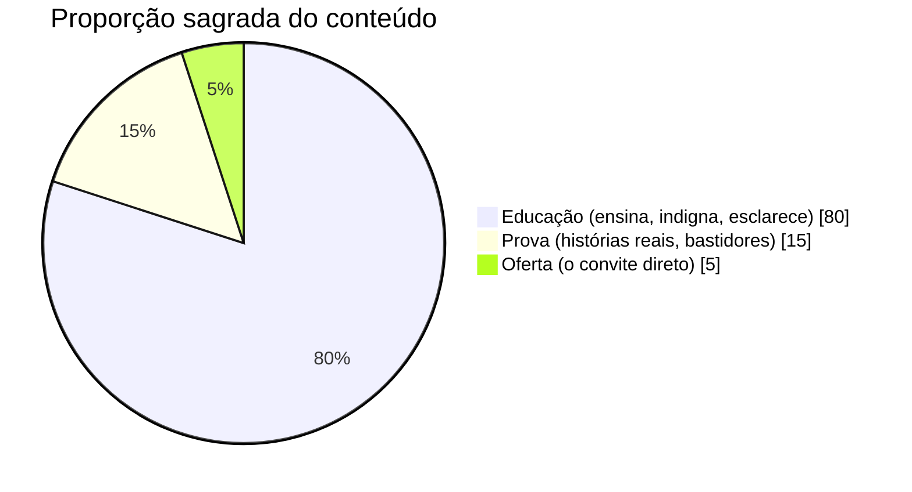
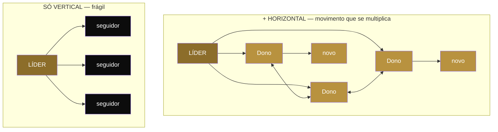
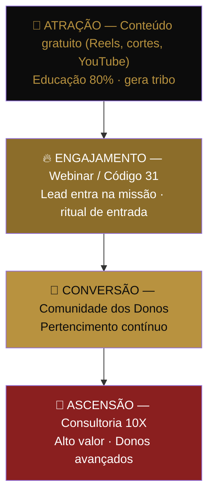

# 📘 O MOVIMENTO DOS DONOS — Documento-Mãe

> **Versão Oficial · Uso interno · Treinamento · Escala**
> Autor: Anthony Miranda
>
> _"O primeiro imóvel é para você. O segundo é para uma geração."_

A arquitetura completa da tribo. Ideologia, identidade, ritual, linguagem, conteúdo, mídia e funil — em um só documento. Este é o arquivo que treina qualquer pessoa que entra no ecossistema. Time, cortadores, designers, tráfego, copy e assessoria operam a partir daqui.

---

## 📑 Sumário

### Camada I — A Engenharia da Tribo _(como a tribo é construída)_

| # | Peça | O que é |
|---|------|---------|
| [00](#-peça-00--a-carta-da-tribo) | **A Carta da Tribo** | O pacto de uma página. Quem somos e o que juramos. |
| [01](#-peça-01--o-manifesto-oficial) | **O Manifesto Oficial** | O texto emocional que faz alguém querer pertencer. |
| [02](#-peça-02--as-7-camadas-do-movimento) | **As 7 Camadas do Movimento** | A engenharia da tribo, camada por camada, com diagrama. |
| [03](#-peça-03--linguagem-e-vocabulário-da-tribo) | **Linguagem e Vocabulário da Tribo** | O dicionário oficial. Como todo mundo fala. |
| [04](#-peça-04--diretrizes-de-conteúdo) | **Diretrizes de Conteúdo** | O que pode, o que não pode, e o protocolo 80/15/5. |
| [05](#-peça-05--guia-de-mídia-e-pr) | **Guia de Mídia e PR** | Como se portar em podcast, jornal, TV e cortes. |
| [06](#-peça-06--o-ritual-de-reconhecimento) | **O Ritual de Reconhecimento** | A conexão Dono ↔ Dono. A tribo que cria tribos. |
| [07](#-peça-07--o-placar-do-movimento) | **O Placar do Movimento** | Progresso público. A contagem regressiva para a liberdade. |
| [08](#-peça-08--guia-do-funil) | **Guia do Funil** | Do estranho ao Dono. A escada de valor e os CTAs. |

### Camada II — A Doutrina de Escala _(como a tribo vira movimento de massa)_

> As 7 peças que transformam uma tribo bem construída numa nação de 100 mil famílias. Cada uma tem um documento completo em [`doutrina/`](doutrina/). Aqui no Documento-Mãe ficam a essência e o link.

| # | Peça | O que resolve | Risco se faltar |
|---|------|---------------|-----------------|
| [09](doutrina/09-a-origem.md) | **A Origem** | A ferida do líder vira missão (Story of Self) | Movimento sem alma — lógica não atravessa fogo |
| [10](doutrina/10-a-travessia-do-abismo.md) | **A Travessia do Abismo** | As Duas Marchas: fanático × pragmático | 🔴 Teto antes das 100 mil — a guerra afasta a maioria |
| [11](doutrina/11-celulas-e-capitaes.md) | **As Células e os Capitães** | Liderança distribuída, crescimento por divisão | 🔴 O líder vira gargalo — não escala |
| [12](doutrina/12-os-anticorpos.md) | **Os Anticorpos** | Protocolo de crise e prevenção | 🔴 Morre na primeira crise mal respondida |
| [13](doutrina/13-a-liturgia-permanente.md) | **A Liturgia Permanente** | A cadência que retém depois do Código 31 | Euforia com prazo de validade — não fixa |
| [14](doutrina/14-os-fundadores.md) | **Os Fundadores** | Honrar os 1.000 primeiros (First Follower) | Joga fora a lealdade mais barata e forte |
| [15](doutrina/15-a-iconografia.md) | **A Iconografia** | O símbolo visível que se ostenta | Tribo que ninguém vê não existe |

---

## 🪧 PEÇA 00 — A Carta da Tribo

> Uma página. O documento de pertencimento. Lê-se antes de entender a mecânica — porque pertencer vem antes de aprender.

### Quem somos

Somos o **Movimento dos Donos**. Não somos alunos, não somos seguidores, não somos clientes. Somos pessoas comuns que decidiram parar de pedir permissão ao banco para ter o que é nosso. O contrário de endividado não é "quitado". O contrário de endividado é **DONO**.

### Contra o que lutamos

Lutamos contra o sistema que treinou o brasileiro a financiar a vida inteira — a entregar 30 anos de trabalho em troca de uma coleira chamada parcela. O financiamento é a coleira. O banco é o dono. Nós viemos para inverter essa relação.

### O que buscamos

**100 mil famílias livres.** Não é uma meta de vendas. É uma missão. Cada família que sai da escravidão do financiamento é uma prova viva de que o jogo pode ser jogado de outro jeito.

### Como nos comportamos

Com disciplina e frieza. Não gritamos — apontamos o absurdo com calma, e a calma destrói o sistema. Não vivemos de aparência. Honramos o **Código 31**: 31 dias de comportamento que transformam quem entra. Quem cumpre o ritual, vira Dono.

### O que significa ser Dono · O que significa Nunca Financiar

Ser Dono é ter liberdade, patrimônio e responsabilidade no jogo de longo prazo. Nunca Financiar não é nunca dever — é nunca aceitar dívida cara e burra quando existe dívida inteligente. É **pagar menos e possuir mais**.

> ### O primeiro imóvel é para você. O segundo é para uma geração.
> O pacto da tribo: o que construímos não termina em nós. Começa em nós.

### A promessa e o pacto

**Nossa promessa:** ensinamos o caminho que o banco escondeu. Sem atalho mágico, com método e matemática.
**Nosso pacto:** quem aprende, ensina. Quem liberta a si, ajuda a libertar o próximo. É assim que 100 mil famílias se tornam livres — uma puxando a outra.

---

## 🔥 PEÇA 01 — O Manifesto Oficial

Você foi treinado. Treinado para achar que financiar a casa por 30 anos é "conquista". Treinado para comemorar a aprovação do banco como se fosse liberdade — quando era o contrário.

> **O brasileiro não é burro. Ele foi treinado para financiar.**

A gente para por aqui. A gente olha a conta, faz a matemática fria, e enxerga o que sempre esteve na nossa frente: existe outro caminho. O caminho do consórcio, do lance, da alavanca. O caminho de quem paga menos e possui mais.

Não viemos vender um sonho. Viemos tirar uma venda dos olhos. Aqui ninguém vive de aparência — aqui todo mundo vira Dono. E Dono não pede permissão.

> **Isso não é opinião. Isso é matemática.**

Somos 100 mil famílias caminhando para a mesma direção: a liberdade. Não pela sorte, mas pela disciplina. Não em 30 anos, mas no tempo de quem decide jogar o jogo certo.

E quando você chegar lá, lembra do pacto:

> **O primeiro imóvel é para você. O segundo é para uma geração.**

_— Anthony Miranda, pelo Movimento dos Donos_

---

## 🏛️ PEÇA 02 — As 7 Camadas do Movimento

> A engenharia da tribo (Seth Godin aplicado). Cada camada tem uma função e um tom. Juntas, transformam um estranho em Dono.

> **A base é a guerra. O topo é a voz que a conduz. Quanto mais fundo, mais inegociável.**

### 1 · Ideologia — A Guerra

**Função:** declarar o inimigo, gerar polarização, criar movimento. Sem inimigo, não existe tribo. Sem guerra, não existe viralização. O inimigo é o sistema bancário que prende o brasileiro por 30 anos.
**Tom:** indignação moral + frieza cirúrgica.

> 🗣️ **Frase-mãe:** _"O brasileiro não é burro. Ele foi treinado para financiar."_

### 2 · Visão — O Destino

**Função:** criar missão histórica. Não é sobre dinheiro nem sobre consórcio — é sobre libertar famílias do sistema. É maior que o Anthony, maior que a empresa. É uma causa que transforma seguidor em discípulo.
**Tom:** histórico, grandioso, inevitável.

> 🗣️ **Frase-mãe:** _"Quando você me segue, não está seguindo um influenciador. Está ajudando a libertar 100 mil famílias brasileiras."_

### 3 · Identidade — A Tribo

**Função:** transformar seguidores em membros. Aqui mora o pertencimento, os valores comuns, a linguagem própria, os símbolos e rituais. A pessoa não compra um curso — ela se torna parte do Movimento dos Donos.
**Tom:** exclusivo, forte, de irmandade.

> 🗣️ **Frase-mãe:** _"Aqui ninguém vive de aparência. Aqui todo mundo vira Dono."_

### 4 · Ritual — A Rotina

**Função:** criar disciplina e transformação real. O **Código 31** é o rito de passagem: 31 dias de disciplina, comportamento, decisão e micro-vitórias. O ritual não ensina — ele molda a identidade. Gera dopamina, hábito e vínculo.
**Tom:** disciplina militar, teste de fogo.

> 🗣️ **Frase-mãe:** _"31 dias para virar Dono. 31 dias para quebrar o sistema."_

### 5 · Mecânica — O Como

**Função:** explicar o método de forma simples e viral. O consórcio é a ferramenta, o lance é a alavanca, a estratégia é o diferencial. Reduzido a uma frase impossível de esquecer.
**Tom:** didático + objetividade de investidor.

> 🗣️ **Frase-mãe:** _"O banco te vende dívida cara. Eu te ensino dívida inteligente."_

### 6 · Prova — A Evidência

**Função:** validar a visão com fatos vivos. Histórias de alunos, escrituras, arremates, casos reais, bastidores da holding, imóveis e processos (Iturama, Urbanova). Prova social é o sangue que dá vida à tribo.
**Tom:** documental, jornalístico, real.

> 🗣️ **Frase-mãe:** _"Se existe um brasileiro fazendo, todos podem fazer."_

### 7 · Voz — O Tom

**Função:** definir a comunicação. A voz mistura frieza técnica, clareza lógica e indignação moral. Você não grita — aponta o absurdo com calma.
**Tom:** lucidez + revolta legítima.

> 🗣️ **Frase-mãe:** _"Isso não é opinião. Isso é matemática."_

### Resumo das camadas

| Camada | Função na tribo | Tom |
|--------|-----------------|-----|
| Ideologia | Declarar o inimigo | Indignação + frieza |
| Visão | Criar a missão | Histórico, inevitável |
| Identidade | Gerar pertencimento | Irmandade |
| Ritual | Moldar comportamento | Disciplina militar |
| Mecânica | Tornar o método viral | Investidor didático |
| Prova | Validar com fatos | Documental |
| Voz | Dar magnetismo | Lucidez + revolta |

---

## 🗣️ PEÇA 03 — Linguagem e Vocabulário da Tribo

> Tribo tem língua própria. Estes termos são inegociáveis: todo mundo — copy, cortador, tráfego, time — usa exatamente assim. A linguagem cria a fronteira entre quem é de dentro e quem é de fora.

| Termo | O que significa | Como usar |
|-------|-----------------|-----------|
| **Nunca Financia** | O grito de guerra. Recusa à dívida cara e burra do banco. | Abre vídeo, fecha palestra, gera polêmica. |
| **Dono** | A identidade da tribo. Liberdade + patrimônio + responsabilidade. | Sempre no lugar de "aluno", "seguidor" ou "cliente". |
| **Alavanca** | O lance no consórcio. A engenharia que multiplica patrimônio. | "Usar a alavanca", "engenharia de patrimônio". |
| **Código 31** | O rito de passagem de 31 dias. | Como desafio e porta de entrada. |
| **Paga Menos, Possui Mais** | A mecânica em uma frase. | Resumo do método, sempre que explicar o "como". |
| **O Sistema** | O antagonista: o modelo bancário de financiamento. | Nunca personalizar num banco só. "O sistema" é maior. |
| **Dívida inteligente** | O oposto da dívida do banco. Estruturada, planejada. | Contraste direto com "dívida cara". |
| **100 mil famílias livres** | A visão. O destino coletivo. | Sempre que a conversa precisar de causa, não de produto. |
| **O Pacto da Geração** | O mantra do legado: _"O primeiro imóvel é para você. O segundo é para uma geração."_ | Frase-mãe nível mantra. Fecha histórias de prova, eleva a visão, ancora todo material de topo. |

### Status da frase: mantra estrutural

Esta não é uma frase de apoio — é o mantra do movimento, no mesmo nível que um "Just Do It" ou "Think Different" tem para as marcas que viraram movimento. Como essas marcas, ela **não vende o produto, vende a causa**: tira o foco do imóvel e coloca no legado. Regra de uso: aparece na capa de todo material institucional, fecha toda história de transformação real, e nunca é dita de forma apressada — ela respira.

### Regra de ouro da linguagem

Nunca dilua. "Financiamento ruim" não existe no nosso vocabulário — existe "a coleira". "Comprar um curso" não existe — existe "virar Dono". A palavra escolhida carrega a ideologia. Trocar a palavra é enfraquecer o movimento.

---

## 📋 PEÇA 04 — Diretrizes de Conteúdo

> A regra que mantém o movimento consistente em qualquer canal: Instagram, YouTube, TikTok, podcast. Educação primeiro. Oferta por último. Sempre.

### O Protocolo 80 / 15 / 5

- **80% Educação:** o conteúdo que ensina a matemática, expõe o sistema e gera a indignação lúcida. É o que constrói autoridade e tribo.
- **15% Prova:** histórias reais, escrituras, arremates, bastidores.
- **5% Oferta:** o convite direto — e só funciona porque os outros 95% pagaram o caminho.

### O que pode · O que não pode

| ✅ Pode (e deve) | ❌ Não pode |
|------------------|-------------|
| Apontar o absurdo com calma e número na mão | Prometer enriquecimento rápido ou ganho garantido |
| Usar a matemática como prova ("isso não é opinião") | Atacar pessoas, gritar ou perder a frieza |
| Contar histórias reais de transformação | Diluir o vocabulário da tribo |
| Educação silenciosa: ensinar sem pedir nada | Oferta agressiva sem educação antes |
| Polarizar contra "o sistema", nunca contra pessoas | Inventar prova — toda prova é real e verificável |
| Repetir as frases-mãe até virarem bordão | Aconselhar investimento específico como certeza |

### 🔁 Protocolo de Rotação de Conteúdo

Cada produto tem uma "família" de variações que giram para manter frescor sem perder a mensagem central. Regra prática de rotação semanal:

- **Seg–Ter:** educação dura (a matemática, o sistema exposto).
- **Qua:** ritual e identidade (Código 31, o que é ser Dono).
- **Qui:** prova social (história real, bastidor, escritura).
- **Sex:** mecânica aplicada (paga menos, possui mais, na prática).
- **Sáb–Dom:** visão e legado (100 mil famílias, a frase do legado).

### 🌡️ Protocolo de Tom — Frieza + Indignação

Toda peça deve passar por três filtros antes de publicar:

1. **Está lúcida?** Tem número, lógica, clareza.
2. **Está fria?** Sem desespero, sem grito.
3. **Está indignada?** Aponta o absurdo de um jeito que incomoda o sistema.

Se faltar um dos três, a peça volta.

---

## 📡 PEÇA 05 — Guia de Mídia e PR

> Como o líder e o time se portam em podcasts, jornais, TV e cortes. A mídia é palco — e palco amplifica tanto a força quanto o erro.

### As âncoras inegociáveis

Em qualquer aparição, três coisas precisam ser ditas, não importa a pergunta:

1. O inimigo ("o sistema treinou o brasileiro a financiar")
2. A visão ("100 mil famílias livres")
3. A mecânica ("paga menos, possui mais")

Se a entrevista acabar e essas três não foram ditas, a aparição foi desperdiçada.

### Por canal

| Canal | Postura | Objetivo |
|-------|---------|----------|
| Podcast longo | Profundidade, histórias, números. Espaço para a indignação lúcida respirar. | Autoridade + cortes virais. |
| Jornal / TV | Frieza máxima. Frases curtas, à prova de edição. Uma frase-mãe por bloco. | Credibilidade + alcance. |
| Cortes / Reels | Um ponto só. Abre com a polêmica, fecha com a frase-mãe. | Viralização + topo de funil. |
| Entrevista hostil | Não revida no grito. Devolve com número. "Isso não é opinião, é matemática." | Virar o ataque em prova. |

### Sempre · Nunca

| ✅ Sempre | ❌ Nunca |
|-----------|----------|
| Falar em frases curtas e citáveis | Prometer retorno garantido ou dar dica de investimento como certeza |
| Trazer um número concreto por bloco | Citar nome de banco como inimigo pessoal |
| Reconduzir toda pergunta para uma das 3 âncoras | Perder a frieza diante de provocação |
| Deixar uma frase-mãe plantada em cada aparição | Improvisar número que não pode comprovar |

### 🎬 Protocolo de Aproveitamento (1 aparição → muito conteúdo)

- Toda aparição é gravada em alta para gerar cortes.
- Meta: extrair de 5 a 10 cortes por podcast longo.
- Cada corte abre com o gancho mais polêmico dos primeiros 3 segundos.
- Lower third padronizado para "educação silenciosa" da marca.

---

## 🤝 PEÇA 06 — O Ritual de Reconhecimento

> Tribo forte não se conecta só de baixo pra cima (líder → membro). Ela se conecta de lado a lado (Dono ↔ Dono). É a conexão horizontal que transforma seguidor em evangelista — e é assim que uma tribo cria outras tribos.

> **Dono reconhece Dono. Cada um vira porta de entrada de novos.**

### Como um Dono reconhece outro

Todo movimento real tem um sinal de reconhecimento — o aceno entre dois que pertencem ao mesmo grupo. No Movimento dos Donos, o reconhecimento é simples e replicável:

- **A saudação:** "Dono?" — "Dono." A pergunta e a resposta que confirmam o pertencimento.
- **O selo:** quem é Dono se identifica publicamente com o termo, não com "aluno" ou "seguidor". Bio, comentário, apresentação — sempre "Dono".
- **O gesto de prova:** ao fechar uma conquista (escritura, arremate, lance contemplado), o Dono compartilha com a frase do pacto. A vitória de um é combustível da tribo inteira.

### 🌐 Protocolo de Multiplicação — Tribo que cria tribos

O movimento não cresce só pelo líder. Cresce quando cada Dono recruta o próximo. O protocolo:

- Todo Dono novo é apresentado publicamente pela tribo, não só pelo líder.
- Quem traz um novo Dono é reconhecido — o pacto ("quem aprende, ensina") vira status.
- Histórias de transformação sempre creditam quem indicou o caminho.
- Espaços de conexão Dono ↔ Dono (comunidade, encontros, grupos) são tão prioritários quanto o conteúdo do líder.

> 🗣️ **Princípio:** _"Um movimento não é uma audiência ouvindo um líder. É uma tribo que cria outras tribos."_

---

## 📊 PEÇA 07 — O Placar do Movimento

> Transparência é a única opção de um movimento real. A visão "100 mil famílias livres" só vira inevitável quando o progresso é público — quando todo mundo vê o número subir.

> ## Famílias livres até hoje: `_____ / 100.000`
> Atualizado publicamente. O número que prova que o movimento está acontecendo — não é promessa, é placar.

### Por que o placar existe

Um movimento sem progresso visível vira discurso. Com progresso visível, vira força da natureza. Cada família contabilizada é uma prova viva de que o caminho funciona, e cada novo número convida o próximo a entrar. O placar transforma a visão de uma frase bonita em uma contagem regressiva coletiva rumo à liberdade.

### 🎯 Protocolo do Placar

- **O que conta como "família livre":** defina o critério único e público (ex.: imóvel contemplado/quitado via método, sem financiamento bancário). Critério claro evita inflar o número e protege a credibilidade.
- **Onde aparece:** fixado no topo do perfil, citado em toda palestra, atualizado em marco a cada nova conquista.
- **Como se atualiza:** cada nova família entra com a prova real (a mesma prova da Camada 6). Placar e prova social são a mesma coisa, vistos de ângulos diferentes.
- **O ritual do marco:** a cada 1.000 famílias, um momento público de celebração da tribo. Marcos criam dopamina coletiva e relembram que o destino está mais perto.

> ⚠️ **Regra inegociável:** o placar só funciona se o número for real e verificável. No momento em que vira marketing inflado, ele se torna a maior vulnerabilidade do movimento em vez da maior força — porque um movimento construído sobre "matemática, não opinião" não pode ter um placar que não fecha a conta.

### Criterio oficial de contagem

Uma familia entra no placar quando **fecha contrato de consorcio imobiliario pela Yes Consorcio**. Esse e o momento em que a familia escolheu o caminho — plantou a semente. Nao precisa esperar contemplacao nem aquisicao do imovel, porque a decisao ja foi tomada.

| Nivel | Evento | Conta no placar? | Fonte de dados |
|-------|--------|------------------|----------------|
| Semente | Contrato de consorcio fechado | SIM — e esse o marco | Bitrix CRM (deal ganho cat 0) |
| Raiz | Carta contemplada (lance ou sorteio) | Bonus — sobe nivel do Dono | CS / administradora |
| Arvore | Imovel adquirido (leilao ou mercado) | Bonus — case de prova social | CS / escritura |

**Regras de integridade:**
- 1 familia = 1 CPF titular. Mesma familia com 2 cartas conta 1 vez.
- Contagem retroativa: todo contrato Yes desde o inicio da operacao (2024+).
- Atualizacao: todo deal ganho no Bitrix cat 0 incrementa o placar automaticamente.
- Auditoria trimestral: cruzar placar vs contratos reais na administradora.
- O numero e publico. Se alguem pedir a lista, ela existe.

> 🗣️ **Frase-mãe:** _"Não é uma meta de vendas. É uma contagem regressiva para a liberdade de 100 mil famílias."_

---

## 🪜 PEÇA 08 — Guia do Funil

> A jornada do estranho ao Dono. Conteúdo no topo (Vaynerchuk), escada de valor no meio e fundo (Hormozi). Cada degrau entrega valor antes de pedir o próximo passo.

### A escada de valor

| Degrau | Produto | Status | Papel no funil | CTA padrão |
|--------|---------|--------|----------------|------------|
| Topo | Conteúdo gratuito | ATIVO | Atrai, educa, cria tribo | "Segue o movimento" |
| Entrada | Webinar / Código 31 | ATIVO | Converte espectador em lead com ritual | "Entra no Código 31" |
| Núcleo | Comunidade dos Donos | ATIVO (Cademi) | Pertencimento e retenção | "Vira Dono de verdade" |
| Ferramenta | Arremata.AI | ATIVO (SaaS) | Inteligência de leilão (produto e ferramenta interna) | "Usa a alavanca" |
| Topo da escada | Consultoria 10X | ATIVO | Estratégia de patrimônio de alto valor | "Joga o jogo 10X" |

### 🔗 Protocolo de CTA e Rastreamento

- Um único CTA por peça — nunca dois pedidos competindo.
- CTA sempre depois do valor entregue, nunca antes (frictionless selling).
- Todo link carrega UTM padronizada por canal e campanha.
- Tags por origem para mapear de qual conteúdo o Dono entrou.
- Sequência de follow-up automatizada após cada entrada de lead.

### Princípio que une tudo (Hormozi + Vaynerchuk)

Vaynerchuk no topo: dá, dá, dá — valor sem pedir nada, até a tribo confiar. Hormozi na escada: cada oferta vale tanto que dizer não parece burrice. A ponte entre os dois é a frase do legado — porque ninguém sobe a escada por um imóvel. Sobe por uma geração.

> ## Paga menos. Possui mais.
> O movimento inteiro cabe em três palavras. Tudo aqui existe para provar essa frase.

---

## 🧭 Apêndice — Os elementos da tribo (checklist Seth Godin)

Uma tribo precisa de sete elementos. O Movimento dos Donos tem todos:

| Elemento | No Movimento dos Donos |
|----------|------------------------|
| Um líder | Anthony |
| Uma ideia forte | Nunca Financia |
| Uma visão futura | 100 Mil Famílias Livres |
| Uma linguagem | Movimento dos Donos (vocabulário próprio) |
| Um ritual | Código 31 |
| Um território | Instagram + YouTube + Comunidades |
| Um inimigo | O Sistema de Financiamento |

> A Camada I tem os 7 elementos da tribo. A Camada II abaixo é o que falta para a tribo virar **movimento de massa** — a diferença entre uma comunidade forte e uma campanha de nação.

---

# 🏛️ CAMADA II — A DOUTRINA DE ESCALA

> A Camada I constrói a tribo. Mas tribo bem construída ainda não é movimento de 100 mil famílias. Estas 7 peças são a engenharia da escala: a alma que cola, a ponte para a maioria, a estrutura que multiplica, o sistema imune que protege, o ritmo que retém, a lealdade que defende e a bandeira que torna tudo visível.
>
> Cada peça tem documento completo em [`doutrina/`](doutrina/). Abaixo, a essência de cada uma.

### 🩸 Peça 09 — A Origem · [completo →](doutrina/09-a-origem.md)
A ferida do líder convertida em missão (Story of Self, Marshall Ganz). O Documento-Mãe recruta a cabeça pela matemática; a Origem recruta o coração pela ferida reconhecida. Estrutura de 5 batimentos — Coleira, Conta, Recusa, Preço, Volta — que o Anthony preenche com a **verdade dele** (nunca inventada). Blindada pela **Lei Anti-Ídolo**: a Origem prova que o caminho funciona, não constrói um trono. O herói é o ouvinte; o líder é o guia.
> 🗣️ _"Eu já fui o escravo que você é. Por isso eu sei o caminho de volta."_

### 🌉 Peça 10 — A Travessia do Abismo · [completo →](doutrina/10-a-travessia-do-abismo.md)
🔴 **Risco de escala.** O tom de guerra recruta o fanático (16%) e afasta a maioria pragmática (84%) que só quer pagar menos pela casa. Solução: **As Duas Marchas** — a Marcha da Fé (guerra, identidade) e a Marcha da Razão (conta, prova, zero guerra), que convergem no mesmo Dono. Regra de ouro: nunca misturar as duas na mesma peça. A Razão é também o escudo jurídico do movimento.
> 🗣️ _"O fanático entra pela bandeira. O resto da nação entra pela conta."_

### 🛡️ Peça 11 — As Células e os Capitães · [completo →](doutrina/11-celulas-e-capitaes.md)
🔴 **Risco de escala.** 100 mil ÷ 1 Anthony = impossível. Estrutura em 4 patentes (Líder → Capitães → Células de ~12 → Donos) com **crescimento por divisão celular** — 17 divisões passam de 100 mil. O Capitão é **honra, não emprego**: a camada-tribo nunca se mistura com a camada-comercial (sob pena de virar "pirâmide"). O líder forma Capitães que formam Capitães — e deixa de ser o teto.
> 🗣️ _"Eu não quero 100 mil pessoas me ouvindo. Quero 100 mil pessoas se ouvindo."_

### 🦠 Peça 12 — Os Anticorpos · [completo →](doutrina/12-os-anticorpos.md)
🔴 **Risco de escala.** Movimento grande é alvo grande, e a crise se vence nas primeiras 6 horas. Prevenção (nunca prometer o que não se controla) + protocolo para os 5 tipos de crise: Mártir Reverso, Ataque de Mídia, Risco Jurídico, Placar Furado, Traição Interna. Doutrina fixa: velocidade > perfeição, frieza sempre, número não emoção, uma boca só, transformar ataque em prova.
> 🗣️ _"Eles vão atacar. A gente não grita de volta — a gente mostra a conta."_

### 🔔 Peça 13 — A Liturgia Permanente · [completo →](doutrina/13-a-liturgia-permanente.md)
Código 31 é o batismo; falta a missa de domingo. O **Loop do Dono** (gatilho → ação → recompensa variável → investimento) e o **Calendário Sagrado** em 4 ritmos: o Gesto diário, a Missa semanal (Live + Célula), o Marco mensal (C31 + placar), a Peregrinação anual. Mais os feriados próprios do movimento. Retenção é problema de ritmo, não de convencimento.
> 🗣️ _"A gente não te dá um evento — a gente te dá um ritmo."_

### 🏅 Peça 14 — Os Fundadores · [completo →](doutrina/14-os-fundadores.md)
Os primeiros 1.000 Donos = "Os Fundadores", numerados 001–1.000. Quando bate 1.000, fecha para sempre (escassez real — o tempo não volta). O ativo mais leal e mais barato do movimento: honra quem acreditou **antes da prova existir** (Derek Sivers, o primeiro seguidor). Privilégios de status/acesso/legado — nunca retorno por antiguidade. São os Capitães naturais da Peça 11.
> 🗣️ _"Vocês entraram quando só tinha a minha palavra. Isso não tem preço."_

### 🎖️ Peça 15 — A Iconografia · [completo →](doutrina/15-a-iconografia.md)
A língua (Peça 03) é invisível; falta a bandeira. Os 4 elementos visuais: o **Emblema** (recomendado: A Chave — posse, não permissão), as **Cores** já existentes formalizadas (preto-sistema, dourado-patrimônio, sangue-guerra, branco-verdade), o **Gesto** físico de saudação, e a **Assinatura** tipográfica (adota o estilo Molina). Regra: molde com rigor absoluto, depois solte livre para o mundo.
> 🗣️ _"Dá pra reconhecer um Dono do outro lado da rua — antes dele abrir a boca."_

---

---

## ANEXO A — Operacional: quem executa cada peca

> Toda peca tem um dono. Dono responde pelo resultado, nao pela tarefa. Se nao sabe como, pergunta. Se nao consegue, escala.

### Peca 04 — Conteudo

| Etapa | Responsavel | Entrega |
|-------|-------------|---------|
| Gravar conteudo bruto | Anthony | Video/audio bruto no Drive |
| Editar video longo | Carla (IA) + editor externo | Video editado + thumbnail |
| Cortar reels/clips | Clipadores externos | 3-5 cortes por video longo |
| Aprovar cortes e legendas | Anthony | Aprovacao no WA (OK ou ajuste) |
| Publicar + agendar | Ralph | Postar no IG/YT + agendar horario |
| Copywriting (caption, hook) | Carla (IA) | Caption pronta com CTA unico |
| Rotacao semanal (Seg-Dom) | Carla | Pauta semanal entregue domingo |

**Workflow:** Anthony grava (Seg/Sex) → Carla edita + clipadores cortam (48h) → Anthony aprova (WA) → Ralph publica.

### Peca 05 — Midia e PR

| Etapa | Responsavel | Entrega |
|-------|-------------|---------|
| Prospectar podcasts/midia | Ralph | Lista mensal de oportunidades |
| Agendar participacao | Ralph | Data confirmada no calendario Anthony |
| Preparar briefing pre-aparicao | Carla | 1 pagina: 3 ancoras + dados + case |
| Gravar/participar | Anthony | Aparicao feita |
| Extrair cortes da aparicao | Clipadores | 5-10 cortes por podcast longo |
| Distribuir cortes | Ralph | Publicado em todos os canais |

**Regra:** nenhuma aparicao de midia acontece sem briefing da Carla entregue 24h antes.

### Peca 06 — Reconhecimento e comunidade horizontal

| Etapa | Responsavel | Entrega |
|-------|-------------|---------|
| Curadoria de vitorias (contemplacao, escritura) | Kamila (CS) | Case identificado e encaminhado |
| Produzir post/story de reconhecimento | Carla + clipadores | Peça pronta pro feed |
| Publicar reconhecimento | Ralph | Postado + marcacao do Dono |
| Animar comunidade Cademi | Edwards | Interacao semanal, desafios, destaques |
| Programa de indicacao (Dono traz Dono) | Carla (estrutura) + Edwards (execucao) | Mecanismo ativo com tracking |

### Peca 07 — Placar

| Etapa | Responsavel | Entrega |
|-------|-------------|---------|
| Contagem automatica (deal ganho Bitrix) | Neriton (webhook) | Placar atualizado em tempo real |
| Publicacao do marco (a cada 100 familias) | Carla + Ralph | Post comemorativo |
| Auditoria trimestral | Edwards + Midiane | Cruzamento placar vs contratos |
| Exibicao no site/perfil | Ralph | Numero visivel e atualizado |

### Peca 08 — Funil

| Degrau | Dono operacional | Entrega |
|--------|------------------|---------|
| Conteudo gratuito (topo) | Ralph + Carla | Publicacao constante 80/15/5 |
| Codigo 31 (entrada) | Anthony + Neriton | Evento mensal executado (skill codigo31) |
| Comunidade dos Donos (nucleo) | Edwards + Kamila | Engajamento ativo na Cademi |
| Arremata.AI (ferramenta) | Neriton | SaaS funcionando, onboarding |
| Consultoria 10X (topo) | Anthony | Sessoes entregues, pipeline proprio |

---

_Documento-Mae do Movimento dos Donos · Uso interno · Confidencial_
