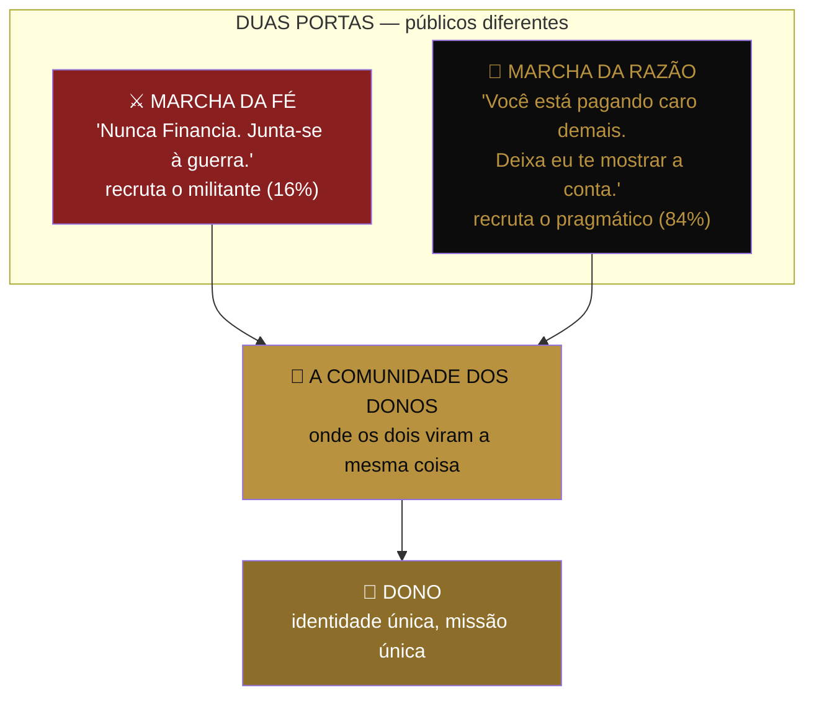

# 🌉 PEÇA 10 — A TRAVESSIA DO ABISMO

> Como o movimento sai de 1.000 fanáticos e chega a 100 mil famílias sem trair nenhum dos dois. A peça que impede o erro que mata 9 em cada 10 movimentos: confundir quem ama a guerra com quem só quer pagar menos pela casa.
>
> _Geoffrey Moore, "Crossing the Chasm". O abismo entre os apaixonados e a maioria. Quem não constrói a ponte, fica preso na margem dos convertidos — barulhento, pequeno e pobre._

---

## O problema que ninguém viu

O Documento-Mãe tem **um tom**: guerra, indignação, frieza cirúrgica, "Nunca Financia". Esse tom é uma arma nuclear — para o público certo. Ele recruta o militante, o early adopter, o sujeito que estava esperando alguém colocar em palavras a raiva que ele já sentia do banco.

Esse público é mais ou menos **16% do mercado**. Os outros 84% não querem uma guerra. Querem a casa. E quando eles ouvem "movimento", "tribo", "o sistema", "31 dias para quebrar o banco" — eles não se sentem convocados. Eles se sentem **em perigo**. O cérebro pragmático lê militância como risco.

> **O abismo:** o que recruta o fanático **afugenta** a maioria. E a missão são 100 mil famílias — não 16 mil fanáticos.

Hoje o funil tem **uma porta só**, e ela está pintada com as cores da guerra. Quem ama a guerra entra. Quem só queria saber da casa, recua. O movimento, do jeito que está, tem um teto matemático embutido bem antes das 100 mil famílias.

---

## A solução: AS DUAS MARCHAS

Uma missão. Dois exércitos. Dois tons de entrada que **convergem no mesmo Dono**.



### ⚔️ Marcha da Fé — para o Convertido

**Quem é:** já odeia o banco, só não tinha palavra pra isso. Quer pertencer a algo. Movido por identidade e causa.
**O que ele ouve:** a guerra inteira. Ideologia, inimigo, 100 mil famílias, "quebrar o sistema". Tudo que já está no Documento-Mãe.
**Onde vive:** topo de funil ideológico — os cortes polêmicos, o manifesto, a indignação lúcida.
**Gatilho de entrada:** _"Cansei de ser otário do banco. Onde eu assino?"_
**Erro fatal:** amornar a mensagem pra ele. O Convertido **despreza** a marcha da razão — pra ele, número sem causa é covardia. Se você suavizar, ele perde o respeito e vai embora.

### 🧮 Marcha da Razão — para o Pragmático

**Quem é:** não quer movimento nenhum. Quer a casa, e desconfia de qualquer coisa que pareça "grupo". Movido por prova, segurança e matemática.
**O que ele ouve:** **zero guerra**. Nenhum "sistema", nenhum "tribo", nenhum "junta-se a nós". Só isto: _"Você provavelmente está pagando o dobro pelo seu imóvel. Olha a conta. Existe um jeito de pagar menos e possuir mais. Quer ver?"_
**Onde vive:** conteúdo educativo frio, comparativos, calculadora, depoimento de gente igual a ele (não de fanático).
**Gatilho de entrada:** _"Peraí... eu tô pagando isso tudo a mais? Me explica."_
**Erro fatal:** jogar a guerra na cara dele cedo demais. Ele não veio para uma cruzada. Falar de "inimigo" e "movimento" no primeiro contato é como pedir casamento no primeiro encontro. Ele corre.

---

## A REGRA DE OURO DAS DUAS MARCHAS

> **Nunca misture as duas marchas na mesma peça.**

Uma peça é da Fé **ou** da Razão. Nunca das duas. A peça da Fé com tempero de Razão fica morna e perde o fanático. A peça da Razão com tempero de Fé fica assustadora e perde o pragmático. **A mistura não soma os dois públicos — ela perde os dois.**

Antes de publicar, o filtro novo: _esta peça é da Fé ou da Razão?_ Se você não souber responder, ela é morna. Volta.

| | Marcha da Fé | Marcha da Razão |
|---|---|---|
| Abre com | A indignação | O número |
| Palavra central | Liberdade | Economia |
| O inimigo | Citado e nomeado ("o Sistema") | Implícito, nunca pregado |
| Vocabulário da tribo | Cheio (Dono, Nunca Financia, guerra) | Quase nenhum — fala a língua dele |
| Prova | A causa, a missão | A conta, o caso parecido com ele |
| CTA | "Entra no movimento" | "Faz a sua simulação" |
| Sente como | Um chamado | Um favor |

---

## A PONTE — onde o pragmático vira fanático

Aqui está o segredo que faz a coisa toda fechar: **o pragmático entra pela razão e é convertido à fé por dentro.**

Ele veio pela conta. Mas quando ele entra na Comunidade dos Donos, quando ele fecha o consórcio, quando ele vê os outros, quando ele sente o pertencimento — aí, e só aí, ele descobre que entrou num movimento. E não recua, porque agora ele **já é de dentro**. A causa que o teria assustado na porta, agora o orgulha por dentro.

> **O pragmático não rejeita a guerra. Ele rejeita ser convocado pra guerra por um estranho.** Depois que ele pertence, a guerra vira dele também.

E o caminho inverso também acontece: o fanático que entrou pela Fé é **equipado com a Razão** lá dentro — ganha a matemática, os números, a calculadora — pra ele parar de só gritar e começar a converter os outros com prova. O militante sem número é barulho. O militante com número é exército.

```
PRAGMÁTICO:  entra pela Razão  →  pertence  →  abraça a Fé   →  vira evangelista
FANÁTICO:    entra pela Fé     →  pertence  →  ganha a Razão →  vira conversor
                                      ↓
                              os dois viram DONO
```

---

## Implicação operacional — o que muda no funil

A Peça 08 (Funil) e a Peça 04 (Conteúdo) hoje assumem uma marcha só. Ajuste:

| Camada do funil | Marcha dominante | Mix sugerido |
|---|---|---|
| Topo (cortes virais, alcance) | **Fé** puxa o alcance (polêmica viraliza) | 70% Fé / 30% Razão |
| Meio (quem clicou, quer saber) | **Razão** segura o pragmático | 30% Fé / 70% Razão |
| Conversão (simulação, contato closer) | **Razão** pura — aqui é a conta, não a cruzada | 10% Fé / 90% Razão |
| Comunidade (já é Dono) | **Fé** plena — agora pertence | 90% Fé / 10% Razão |

> A guerra é o **ímã** (atrai e viraliza no topo). A matemática é a **ponte** (converte no meio). O pertencimento é a **cola** (retém no fundo). Hoje o playbook tem o ímã e a cola, e quase nenhuma ponte. A Marcha da Razão é a ponte que faltava.

### O alerta de compliance embutido

A Marcha da Razão tem uma vantagem que não é só de marketing: ela é **mais segura juridicamente**. Conta, comparativo e prova verificável não prometem nada — mostram. Num cenário onde o movimento já é alvo (MPF, administradora, "promessa de imóvel"), a Marcha da Razão é o rosto que você mostra pra imprensa e pro regulador. A Marcha da Fé inflama, mas é a Razão que defende. **Toda promessa mora na Fé; toda prova mora na Razão.** Quando a tempestade vier (Peça 12), você se ancora na Razão.

---

## Frase-mãe da peça

> 🗣️ _"O fanático entra pela bandeira. O resto da nação entra pela conta. A missão precisa dos dois — e o erro é falar com os dois ao mesmo tempo."_

---

_Peça 10 do Movimento dos Donos · A estratégia de escala · Sem ela, o teto chega antes das 100 mil_
