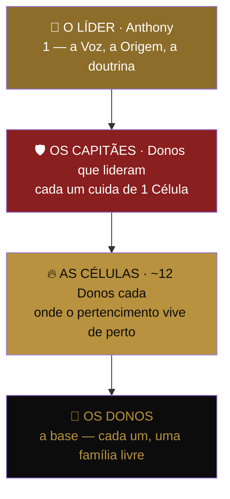

# 🛡️ PEÇA 11 — AS CÉLULAS E OS CAPITÃES

> Como 1 voz vira 100 mil sem o líder virar gargalo. A peça que transforma uma audiência (frágil, depende do líder aparecer) numa nação (resiliente, cresce sozinha). O movimento não escala pela boca do Anthony amplificada — escala pela boca do Anthony **replicada**.
>
> _Marshall Ganz, modelo "floco de neve" (snowflake leadership) da campanha de 2008 + estrutura de igreja em células (G12). A multiplicação que os movimentos religiosos descobriram há 2 mil anos e a política redescobriu em 2008._

---

## O teto que o playbook não viu

A Peça 06 (Reconhecimento) diz a coisa certa: _"Dono traz Dono"_, conexão horizontal, tribo que cria tribos. Mas para por aí — no **princípio**. Não tem a **estrutura**.

Sem estrutura, "Dono traz Dono" é torcida, não exército. E a conta não fecha:

> 100 mil famílias ÷ 1 Anthony = **impossível**. O líder não tem 100 mil horas. Um movimento que depende do líder falar com cada membro tem o tamanho da agenda do líder. Hoje, o teto do movimento é o teto do Anthony.

A história já resolveu isso. Jesus não pregou para 100 mil — formou **12**. Os 12 formaram os seus. Em 300 anos, sem internet, virou o maior movimento da história. A campanha de Obama em 2008 não tinha staff para 13 milhões de voluntários — tinha **organizadores que formavam líderes que formavam equipes**. A estrutura é sempre a mesma: o líder não multiplica seguidores, multiplica **líderes**.

---

## A ESTRUTURA — as 4 patentes do movimento



| Patente | Quem é | Quantos cuida | Função |
|---------|--------|---------------|--------|
| 👑 **Líder** | Anthony | A nação inteira | Dá a Voz, a doutrina, a Origem. Forma Capitães. |
| 🛡️ **Capitão** | Dono que provou e quis liderar | ~12 Donos (1 Célula) | Reúne a célula, anima, multiplica. O músculo do movimento. |
| 🔥 **Célula** | Grupo de ~12 Donos | — | O lar. Onde o Dono não se sente número, se sente irmão. |
| 👤 **Dono** | Toda família que fechou | — | A base e o propósito. Candidato natural a futuro Capitão. |

### Por que 12

Doze não é número de marketing — é **limite de intimidade humana**. Acima disso, vira plateia; o Dono volta a ser número. Doze é o tamanho onde todo mundo sabe o nome de todo mundo, onde a ausência de um é notada, onde a vitória de um é festa de todos. É o número dos 12 de Jesus, das mesas de jantar, das equipes que funcionam. Ressoa com a base do Anthony e com a natureza humana ao mesmo tempo.

---

## O CRESCIMENTO POR DIVISÃO CELULAR — o mecanismo exponencial

Aqui está a engenharia que faz 100 mil parar de ser sonho. Movimento que cresce por **adição** (cada membro novo = +1) leva séculos. Movimento que cresce por **divisão celular** (cada célula vira duas) é exponencial — é como a vida se espalha, é como a fé se espalhou, é como vírus crescem.

```
Uma célula nasce com ~6.  Cresce até ~12-15.
Quando chega a ~15, ela NÃO vira uma célula de 24.
Ela DIVIDE em duas de ~7-8 — e um novo Capitão é ungido.

        🔥 12          →     🔥 7   +   🔥 7
   (1 Capitão)              (2 Capitães)

1 → 2 → 4 → 8 → 16 → 32 → 64 → 128 ...
```

> **A divisão é vitória, não perda.** O instinto humano odeia dividir o grupo que ama — parece quebrar a família. A doutrina inverte isso: **dividir é parir**. A célula-mãe não perde metade, ela **gera** uma filha. O Capitão que divide sua célula não foi rebaixado — foi **promovido**, porque agora há dois Capitães onde havia um. Celebra-se a divisão como se celebra um nascimento.

A matemática brutal: 17 divisões celulares partindo de 1 célula passam de 100 mil pessoas. **Dezessete.** O movimento inteiro cabe em 17 multiplicações — se cada célula souber dividir.

---

## O CAPITÃO — o cargo mais importante do movimento

### Quem pode virar Capitão

Não se candidata: é **ungido**. Critério, nesta ordem:

1. **É Dono de verdade** — fechou, está no jogo, vive o que prega. Não existe Capitão que não pagou o próprio preço.
2. **Já trouxe outro Dono** — provou que multiplica antes de receber o título. O título reconhece o que a pessoa já faz, não o que promete fazer.
3. **Vive a frieza + indignação** — encarna o tom. Não é o mais barulhento; é o mais firme.
4. **Serve, não manda** — quer carregar os outros, não ser admirado por eles. (Mesma Lei Anti-Ídolo da Peça 09, agora em escala: Capitão que vira ego é câncer de célula.)

> ⚠️ **Capitão é HONRA, não EMPREGO.** Aqui mora a linha mais delicada do movimento: o Capitão é um **voluntário ungido**, não um vendedor disfarçado. Ele não recebe comissão por ser Capitão. Ele lidera porque pertence. No momento em que "Capitão" virar cargo pago de vendas, a tribo morre e vira pirâmide — e a imprensa e o MPF estão esperando exatamente essa palavra. **A camada da tribo (Capitães/Células) é separada da camada comercial (closers/Yes). Nunca, jamais, se misturam.** Closer vende. Capitão pertence. Confundir os dois é suicídio jurídico e moral.

### O que o Capitão faz — o Rito da Célula

| Cadência | O quê |
|----------|-------|
| **Toda semana** | Reúne a célula (15-30 min, online). Cada um diz: uma vitória, um aperto, um próximo passo. Ninguém fica invisível. |
| **Todo Dono novo** | Recebe pessoalmente, apresenta à célula, conta a própria Origem (Peça 09). |
| **Toda vitória (carta, escritura)** | Transforma em festa da célula e manda pro placar (Peça 07). |
| **Todo aperto** | É o primeiro a saber. A célula segura quem cambaleia antes do Dono pensar em desistir. |
| **Quando a célula cresce** | Identifica o próximo Capitão e prepara a divisão. |

### O que o Capitão recebe — a moeda do reconhecimento

Não é dinheiro. É **status, acesso e legado** — as três moedas que movem quem já tem dinheiro resolvido e busca significado:

- **Patente pública** — o selo de Capitão, visível, honrado pela tribo inteira.
- **Acesso ao Líder** — encontro direto e periódico com o Anthony, fechado para Capitães. A linha direta com a Voz.
- **Formação** — o Capitão é treinado na doutrina, na Origem, na mecânica. Vira mais forte por liderar.
- **Legado contado** — cada Dono que a célula dele liberta é creditado a ele. O nome do Capitão fica nas histórias.

---

## A FORMAÇÃO — como o Líder forma Capitães sem virar gargalo

O Anthony não fala com 100 mil. Ele forma **os primeiros Capitães** — e os Capitães formam Capitães. A doutrina sobe uma vez e desce por gravidade.

```
Anthony forma  →  os primeiros ~12 Capitães (saem dos Fundadores, Peça 14)
   cada um forma  →  sua célula, e dela ungem novos Capitães
      e assim a doutrina desce  →  sem o Anthony precisar estar em cada sala
```

O instrumento: **A Cartilha do Capitão** — documento curto que todo Capitão recebe, contendo (a) como rodar o Rito da Célula, (b) como contar a própria Origem, (c) os inegociáveis do tom e do vocabulário, (d) a Lei Anti-Ídolo, (e) o que fazer numa crise (Peça 12), (f) quando e como dividir a célula. _(A construir — é o próximo artefato desta peça.)_

> 🔑 **O destravamento final:** quando existirem Capitães formando Capitães, o crescimento do movimento **se descola da agenda do Anthony**. Ele para de ser o teto e vira a raiz. A raiz não precisa tocar cada folha — ela alimenta o tronco, o tronco alimenta os galhos. É assim, e só assim, que 1 vira 100 mil.

---

## Conexões com o resto do movimento

- **Peça 14 (Fundadores):** os primeiros Capitães saem naturalmente dos 1.000 Fundadores. Quem estava lá no começo lidera o que vem depois.
- **Peça 06 (Reconhecimento):** a Célula é o "espaço Dono↔Dono" que a Peça 06 pedia mas não estruturava. Esta peça é a Peça 06 com esqueleto.
- **Peça 13 (Liturgia):** o Rito da Célula é o batimento semanal da liturgia do movimento.
- **Cruzeiro / incentivos:** o reconhecimento dos Capitães pode plugar no programa de incentivo anual — mas como **honra**, nunca como salário.

---

## Frase-mãe da peça

> 🗣️ _"Eu não quero 100 mil pessoas me ouvindo. Eu quero 100 mil pessoas se ouvindo. O líder que precisa estar em toda sala construiu uma plateia. Quem forma capitães construiu uma nação."_

---

_Peça 11 do Movimento dos Donos · A estrutura de escala · Sem células, o movimento tem o tamanho da agenda do líder_
