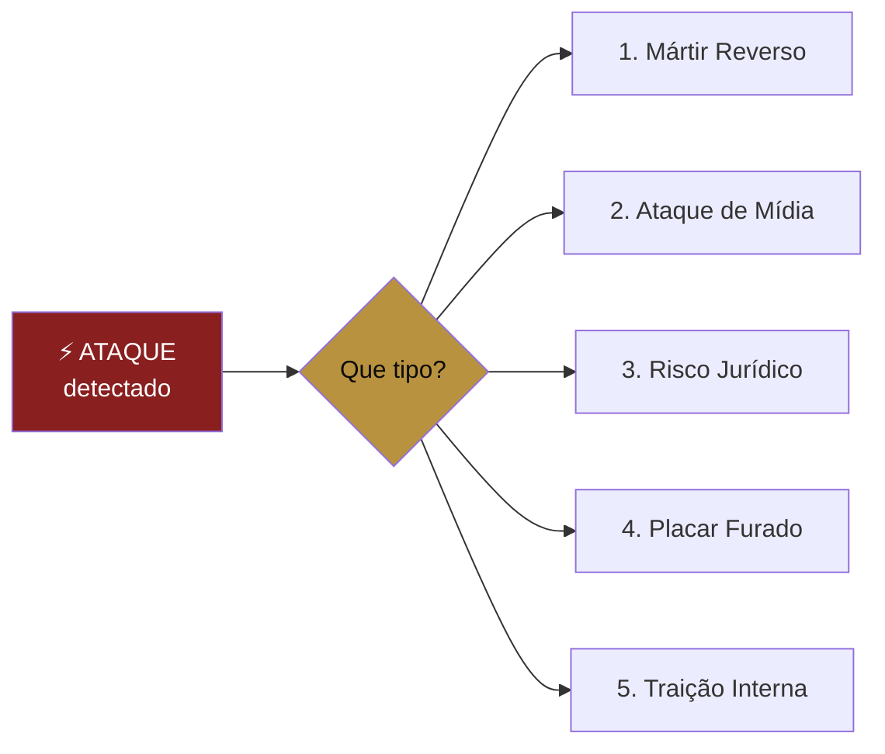

# 🦠 PEÇA 12 — OS ANTICORPOS

> O protocolo de crise do movimento. A peça que decide se o movimento sobrevive ao primeiro ataque sério — e ele virá, porque movimento grande é alvo grande. A maioria dos movimentos não morre de fraqueza. Morre de uma crise mal respondida nas primeiras 6 horas.
>
> _Bill Moyer, "Movement Action Plan" — a Armadilha do Fracasso Aparente, o estágio onde quase todo movimento desiste. + Douglas Atkin sobre a diluição que mata marcas-tribo. + a realidade jurídica concreta do Grupo Mirandas (MPF, administradora, precedentes)._

---

## A verdade que ninguém quer escrever no playbook

Quanto mais o movimento crescer, mais ataques vai atrair. Isto não é pessimismo — é física social. Um movimento que se vende como _"isso é matemática, não opinião"_ está convidando o mundo inteiro a **conferir a conta**. No dia em que uma conta não fechar, o slogan vira arma apontada para o próprio peito.

O Documento-Mãe tem uma única linha sobre isso, na Peça 07: _"no momento em que o placar vira marketing inflado, ele se torna a maior vulnerabilidade do movimento."_ Verdadeiro — e solitário. Não há protocolo. Esta peça é o sistema imunológico que faltava.

> **Regra-mãe da crise:** a crise não se vence na hora da crise. Se vence **antes** (prevenção) e nas **primeiras 6 horas** (resposta). Depois de 24 horas de silêncio, você já perdeu — não importa quão boa seja a resposta tardia.

---

## PARTE 1 — A PREVENÇÃO (o anticorpo que se produz antes da doença)

A crise mais barata é a que não acontece. Os 5 inegociáveis de prevenção, que valem mais que qualquer manual de resposta:

1. **Nunca prometer o que não se controla.** "Imóvel de graça", "contemplação garantida", "todo mundo é contemplado", "rentabilidade certa". Cada uma dessas frases é uma bomba com pavio aceso. A mecânica do movimento é _"paga menos, possui mais"_ — uma comparação verificável, não uma promessa de resultado. **Toda promessa de resultado é dívida que o movimento vai ter que pagar em juízo.**

2. **A Marcha da Razão é o escudo (Peça 10).** Conta, comparativo e prova real não prometem — mostram. Quando a tempestade vier, o rosto que você expõe ao regulador e à imprensa é o da Razão (frio, numérico, verificável), nunca o da Fé (inflamado, messiânico). A Fé recruta; a Razão defende.

3. **O placar tem que fechar (Peça 07).** Número público só é força se for real. 1 família = 1 CPF, contagem auditável, lista existe se pedirem. Um placar inflado descoberto destrói tudo que a matemática construiu — porque o movimento inteiro foi vendido como honestidade matemática.

4. **A Lei Anti-Ídolo é blindagem (Peça 09).** Movimento que é culto ao líder cai com o líder. Movimento que serve às 100 mil famílias sobrevive ao líder. Quanto menos o Anthony for o centro, menos vulnerável o movimento é a um ataque pessoal contra o Anthony. _"O bilhão não é meu, é das famílias"_ não é só missão — é **para-raios**.

5. **Capitão não é vendedor (Peça 11).** A separação entre a camada-tribo (honra) e a camada-comercial (comissão) é o que impede a palavra "pirâmide" de colar. Mantida essa parede, o ataque "é esquema" não tem onde se fixar.

---

## PARTE 2 — OS 5 TIPOS DE CRISE E O PROTOCOLO DE CADA

### 1 · O MÁRTIR REVERSO — um Dono que se deu mal, reclama em público

**O que é:** um cliente insatisfeito (real ou exagerado) viraliza "fui enganado pelo Anthony Miranda". O ataque mais perigoso, porque tem rosto humano e a prova social trabalha contra você.

**Protocolo:**
- **Nunca brigar com o cliente em público.** Você nunca ganha — ou ele é vítima, ou você é o grande que esmaga o pequeno. Os dois te derrotam.
- **Resolver no privado, rápido.** Equipe de CS (Kamila) entra em contato em **horas**, não dias. A maioria do "fui enganado" é "não fui ouvido".
- **Se tiver razão, atender com generosidade** (mesmo além da obrigação) — um detrator resolvido vira o melhor depoimento que existe.
- **Se for má-fé/golpe contra o movimento,** responder UMA vez, com fato e documento, com frieza, e não alimentar. _"Aqui está o contrato que ele assinou, aqui está o que foi entregue. Isso não é opinião."_
- **O que NUNCA fazer:** apagar o comentário (vira "ele censura"), processar publicamente (vira "ele intimida"), ou sumir.

### 2 · O ATAQUE DE MÍDIA / INFLUENCER — "consórcio é furada", "é o novo golpe"

**O que é:** jornalista, influenciador de finanças ou concorrente ataca a tese. Muitas vezes é **oportunidade disfarçada** — palco grátis.

**Protocolo:**
- **Frieza máxima, número na mão.** É a "entrevista hostil" da Peça 05 levada à crise: _não revida no grito, devolve com matemática._ A calma destrói o ataque inflamado — quem grita parece culpado, quem mostra a conta parece dono da verdade.
- **Reconduzir para a Origem (Peça 09) e a Razão (Peça 10).** "Deixa eu te mostrar por que eu entrei nisso, e deixa eu te mostrar a conta."
- **Transformar ataque em prova.** Um ataque bem respondido recruta mais que dez posts. O movimento já prevê isso: _"virar o ataque em prova"_.
- **Porta-voz único.** Em crise de mídia, **só uma boca fala pelo movimento** — definida antes (ver Parte 3). Capitão e Dono não dão entrevista sobre a crise. Um movimento com dez bocas em crise é dez versões = zero credibilidade.

### 3 · O RISCO JURÍDICO — MPF, administradora, ação, regulador

**O que é:** o mais sério, porque não se ganha no Instagram. Inquérito, notificação da administradora, ação por propaganda enganosa. O Grupo Mirandas **já tem histórico aqui** — isto não é hipótese.

**Protocolo:**
- **O Jurídico assume, não o marketing.** Aqui a comunicação **para e escuta o advogado** antes de qualquer post. A vontade de "responder à altura" publicamente é exatamente o que o adversário jurídico quer.
- **Congelar a peça de risco.** Se o ataque aponta uma promessa específica ("imóvel de graça"), aquela peça sai do ar **na hora**, em todos os canais, e vira caso de aprendizado — sem alarde.
- **A Razão é a defesa documentada.** Tudo que é Marcha da Razão (conta, comparativo, prova) é defensável. Tudo que é Marcha da Fé inflamada é indefensável em juízo. Por isso a Peça 10 importa para a sobrevivência, não só para a escala.
- **Transparência proativa com o regulador** desarma mais que silêncio. Movimento que abre o livro antes de ser obrigado tira a arma do acusador.
- **Conexão:** este protocolo se integra ao playbook jurídico e às regras de compliance já existentes (nunca "imóvel de graça", LGPD nas provas, etc.).

### 4 · O PLACAR FURADO — "esse número é mentira"

**O que é:** alguém acusa o placar de "100 mil famílias" de ser inflado. Ataque direto ao coração da tese (honestidade matemática).

**Protocolo:**
- **A lista existe — mostra a lista** (respeitando LGPD: agregado, auditável, sem expor dados). A Peça 07 já manda: _"se alguém pedir a lista, ela existe."_ Em crise, isso vira ação, não promessa.
- **Critério público e único:** 1 família = 1 CPF, contrato fechado, auditoria trimestral. Repete o critério com calma. Critério claro é à prova de acusação.
- **Se houver erro real, corrige em público, na hora.** _"Conferimos, tínhamos contado X em duplicidade, corrigimos para Y. O número é sagrado demais pra gente deixar errado."_ Corrigir publicamente um erro de placar **aumenta** a credibilidade — prova que o número é levado a sério.

### 5 · A TRAIÇÃO INTERNA — alguém de dentro que vaza, trai ou ataca

**O que é:** ex-colaborador, ex-Capitão ou ex-parceiro que vira atacante com informação interna. Dói porque tem credibilidade ("eu vi por dentro").

**Protocolo:**
- **Não transformar em guerra pública pessoal.** Reduz o movimento ao tamanho de uma briga.
- **Reafirmar a doutrina e os fatos,** não atacar a pessoa. O movimento é maior que qualquer indivíduo que saiu — inclusive, um dia, maior que o próprio Anthony (é esse o ponto da Lei Anti-Ídolo).
- **Blindagem preventiva:** acordos, NDAs e a separação de camadas (Peça 11) reduzem a superfície de dano antes de existir.

---

## PARTE 3 — A DOUTRINA DA RESPOSTA (vale para qualquer crise)

Os princípios fixos, independentes do tipo:

| Princípio | Por quê |
|-----------|---------|
| **Velocidade > perfeição** | Responder em horas. O silêncio é interpretado como culpa. Uma resposta 80% boa em 3h vence uma resposta perfeita em 3 dias. |
| **Frieza sempre, grito nunca** | A marca registrada do movimento. _"A calma destrói o sistema."_ Em crise, quem mantém a frieza ganha; quem perde a frieza confirma o ataque. |
| **Número, não emoção** | _"Isso não é opinião, é matemática."_ A defesa do movimento é a mesma arma do ataque dele: o fato verificável. |
| **O líder aparece, não some** | Em crise grande, o Anthony dá a cara — calmo, factual, humano. Sumir é admitir. Mas aparecer ≠ brigar: aparece para esclarecer, não para revidar. |
| **Uma boca só** | Porta-voz único e definido. Capitães e Donos **não comentam a crise** — eles vivem a missão. Dez versões = zero verdade. |
| **Transformar em prova** | Toda crise bem respondida é o melhor conteúdo do trimestre. O ataque vira palco. |
| **Servir desarma** | _"O que tá travando?"_ antes de _"você está errado"_. A mesma régua do Filtro-Base aplicada à crise: começar servindo, não defendendo. |

### O Comitê de Crise — quem decide quando o alarme toca

Antes da crise, definir (a construir):
- **Porta-voz único** (provável: Anthony para crise grande; Edwards/COO para operacional).
- **Quem avalia o tipo** e aciona o protocolo (linha direta Anthony ↔ Edwards ↔ Jurídico).
- **A janela de 6 horas:** detectou → classificou → respondeu. Cronômetro rodando.
- **O canal de detecção:** quem está olhando? (monitoramento de menções, alerta dos Capitães, CS). Crise detectada tarde já é crise perdida.

---

## A REGRA DE OURO DOS ANTICORPOS

> **Um movimento construído sobre "matemática, não opinião" não pode ter UM número que não fecha, UMA promessa que não cumpre, ou UM líder que perde a frieza. A força do movimento e a vulnerabilidade do movimento são a mesma coisa: a verdade. Enquanto a verdade estiver do lado de dentro, nenhum ataque pega. No dia em que uma mentira entrar, todo ataque vira fatal.**

A prevenção não é um departamento. É a **própria honestidade da operação**. Os anticorpos mais fortes do movimento não estão neste documento — estão em nunca precisar dele.

---

## Frase-mãe da peça

> 🗣️ _"Eles vão atacar. Deixa. A gente não grita de volta — a gente mostra a conta. Quem tem a verdade não precisa levantar a voz."_

---

_Peça 12 do Movimento dos Donos · O sistema imunológico · A crise virá; a pergunta é se o protocolo já existe quando ela chegar_
