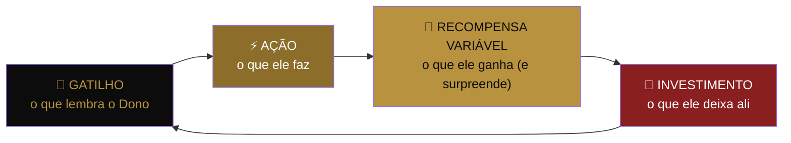
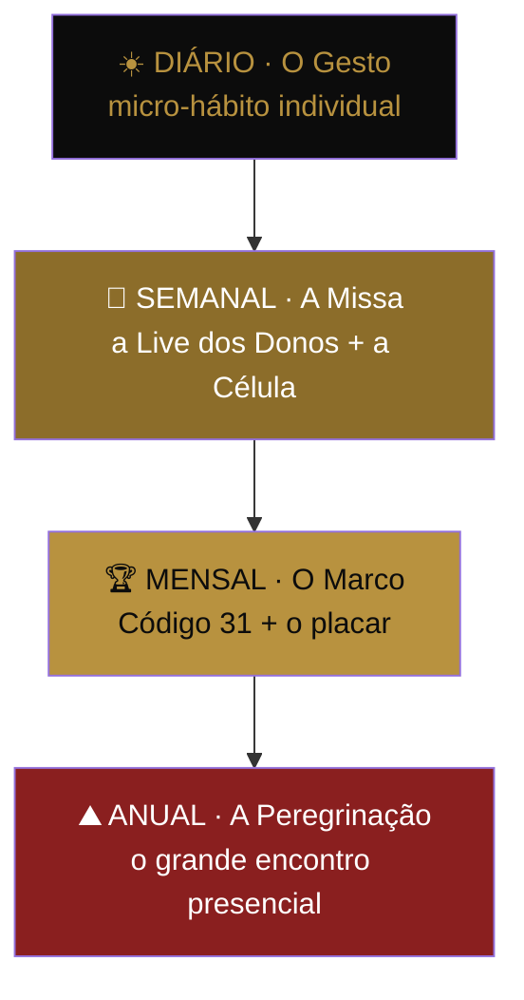

# 🔔 PEÇA 13 — A LITURGIA PERMANENTE

> O calendário sagrado do movimento. A peça que mantém o Dono dentro depois que a empolgação do começo passa. Código 31 é o **batismo** — a entrada. Mas nenhuma fé se sustenta só no batismo. Ela se sustenta na **missa de domingo**: a cadência que repete, lembra e renova.
>
> _Nir Eyal, "Hooked" (o loop do hábito) + BJ Fogg (o gatilho que dispara o comportamento) + 2 mil anos de liturgia religiosa, que descobriu antes de todo mundo como manter um bilhão de pessoas voltando toda semana._

---

## O buraco no funil

A Peça 08 leva o estranho até virar Dono. E depois? O Documento-Mãe não diz o que acontece no **dia 200**. O Código 31 dura 31 dias — e no dia 32, o Dono está sozinho com a empolgação esfriando.

> Movimento sem cadência permanente vira **euforia com data de validade**. A pessoa entra fervorosa, vibra por algumas semanas, e some — não porque desacreditou, mas porque **nada a fez voltar**. A retenção não é um problema de convencimento. É um problema de **ritmo**.

Toda religião que durou séculos resolveu isto com uma palavra: **liturgia**. O calendário que repete. O domingo que sempre volta. O Dono precisa de domingos.

---

## O LOOP DO DONO — a mecânica do hábito (Eyal)

Antes do calendário, a engenharia. Todo hábito que gruda tem quatro tempos. Aplicados ao Dono:

| Tempo | No movimento |
|-------|--------------|
| 🔔 **Gatilho** | A Live semanal no mesmo horário. A reunião da célula. A notificação do placar subindo. O ritual diário. |
| ⚡ **Ação** | Aparecer, comentar, dar a saudação, trazer um Dono, registrar uma micro-vitória. |
| 🎁 **Recompensa variável** | Reconhecimento público (nunca sabe quando vem = vicia), uma resposta do Anthony, ver o próprio nome numa história, o placar bater um marco. O "variável" é o segredo: recompensa certa entedia, recompensa surpresa fideliza. |
| 🌱 **Investimento** | Cada vitória registrada, cada Dono trazido, cada degrau na célula = o Dono **deposita** algo no movimento. E ninguém abandona aquilo onde investiu. Quanto mais ele põe, mais difícil sair. |

> O Código 31 já é um loop perfeito de 31 dias. A Liturgia é o que faz o loop **nunca parar de girar** depois do dia 31.

---

## O CALENDÁRIO SAGRADO — os 4 ritmos

Um movimento vivo pulsa em quatro frequências ao mesmo tempo: o batimento diário, o encontro semanal, o marco mensal e a peregrinação anual.

### ☀️ O ritmo DIÁRIO — O Gesto

O micro-hábito que cabe em 30 segundos e mantém a identidade acesa todo dia. Opções a calibrar:
- **A pergunta do Dono:** toda manhã, uma pergunta de decisão — _"a escolha de hoje me deixa mais dono ou mais devedor?"_ Pequena, mas reposiciona a identidade diariamente.
- **O conteúdo diário** (Peça 04) é o gatilho externo: o Dono abre o app e o movimento está lá. A rotação semanal de conteúdo **é** parte da liturgia — cada dia da semana tem seu tema (a Peça 04 já define isso; aqui ele vira **ritual**, não só calendário editorial).

> O ritmo diário não pesa. Ele só **não deixa esquecer**. Identidade que não é lembrada todo dia, dilui.

### 📡 O ritmo SEMANAL — A Missa

O coração da liturgia. **Toda semana, mesmo dia, mesmo horário** — a previsibilidade é metade do poder. Dois níveis:
- **A Live dos Donos** (movimento inteiro): o Anthony, ao vivo, toda semana. Ensino + uma vitória da semana + o placar atualizado + responder a tribo. É o domingo do movimento. A previsibilidade cria o hábito; a presença do líder cria o vínculo. _(Conecta com a Live de Representantes seg 6h30 e o motor de conteúdo já existentes — a Liturgia organiza o que já roda em ritual nomeado.)_
- **O Rito da Célula** (Peça 11): os ~12 se reúnem. A Live é o pertencimento à **nação**; a Célula é o pertencimento à **família**. O Dono precisa dos dois — o grande que inspira e o pequeno que segura.

### 🏆 O ritmo MENSAL — O Marco

- **Código 31** (Peça 08): a cada mês, uma nova turma entra pelo batismo. Para quem já é Dono, o C31 mensal é a chance de **trazer alguém** (a ação do loop) e de reviver a própria entrada.
- **O Marco do Placar** (Peça 07): cada 100 famílias = celebração pública. A contagem subindo é o gatilho coletivo — o movimento inteiro vê que está acontecendo. _"Não é promessa, é placar."_

### ⛰️ O ritmo ANUAL — A Peregrinação

O encontro **presencial**. Onde a tribo deixa de ser tela e vira corpo. Toda fé tem sua peregrinação — o lugar e a data em que os fiéis se olham no olho. O movimento precisa do dia em que os Donos se abraçam, os Capitães são honrados no palco, os Fundadores (Peça 14) ficam na primeira fila, e o placar do ano é revelado ao vivo.

> ⚠️ **Trava de realidade:** a Peregrinação presencial se constrói pela **Operação A Semente** — testar pequeno antes de escalar. Não se anuncia um estádio antes de provar uma sala. O ritmo anual é o **destino**, conquistado pelos outros três ritmos primeiro. (Ver doutrina de eventos: piloto antes de escala.)

---

## OS FERIADOS DO MOVIMENTO — as datas que só são nossas

Toda tribo tem datas próprias — dias que o calendário comum ignora mas a tribo sacraliza. Marcam o tempo do movimento e dão ocasião para celebrar e recrutar. A construir, com a verdade do movimento:

| Feriado | O que celebra |
|---------|---------------|
| **O Aniversário do Movimento** | O dia em que a primeira família foi livre. A data-zero da contagem. |
| **O Dia do Dono** | Uma data anual de orgulho coletivo — todo Dono posta a própria virada. |
| **Os Marcos do Placar** | 1.000 / 10.000 / 50.000 famílias — cada um vira feriado espontâneo. |
| **A Virada de cada Dono** | O "aniversário" pessoal: o dia em que **aquele** Dono fechou. Celebrado na célula todo ano. |

> Datas próprias transformam tempo em pertencimento. Quem comemora as mesmas datas, pertence à mesma tribo.

---

## A REGRA DE OURO DA LITURGIA

> **A empolgação é grátis e morre sozinha. O hábito custa ritmo e vive para sempre. O movimento não se sustenta no dia em que alguém se emociona — se sustenta nos mil dias em que alguém volta sem nem pensar. Construa os domingos, e o movimento sobrevive às segundas.**

A diferença entre uma campanha e um movimento é esta: a campanha tem fim, o movimento tem **calendário**.

---

## Frase-mãe da peça

> 🗣️ _"Ninguém vira dono num dia de empolgação. Vira dono em mil dias de disciplina. Por isso a gente não te dá um evento — a gente te dá um ritmo."_

---

_Peça 13 do Movimento dos Donos · A retenção · Código 31 é a porta; a Liturgia é a casa onde se mora depois de entrar_
