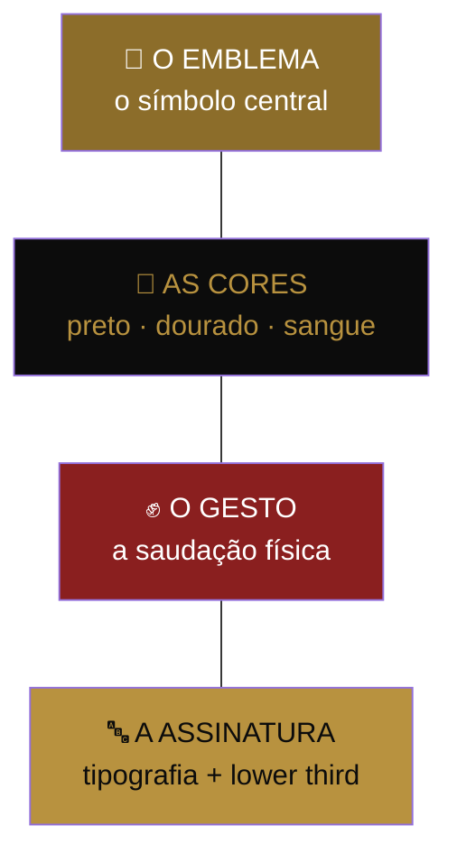

# 🎖️ PEÇA 15 — A ICONOGRAFIA

> A marca que se ostenta. A peça que dá ao movimento um **corpo visível** — o símbolo que o Dono usa na bio, no carro, na camiseta, na pele se quiser. Linguagem (Peça 03) é a língua da tribo; iconografia é a **bandeira** dela. Toda tribo que virou movimento teve as duas.
>
> _Douglas Atkin, "The Culting of Brands" (o símbolo como pertencimento visível) + Seth Godin (o "território" da tribo, que hoje é só citado). A maçã, o swoosh, o boné vermelho, a cruz, a foice: nenhum movimento de massa foi invisível._

---

## O que falta

A Peça 03 deu ao movimento uma língua poderosa — "Dono", "Nunca Financia", a saudação. Mas língua é **invisível**. Você precisa abrir a boca para a tribo aparecer.

Um símbolo é **silencioso e instantâneo**. O boné vermelho do MAGA, a maçã da Apple, a cruz no pescoço — nenhum deles diz uma palavra, e todos comunicam pertencimento à distância, num cruzamento, numa foto, num story de 2 segundos. O Dono precisa de um jeito de dizer "eu sou Dono" **sem dizer nada**.

> Hoje, dois Donos podem passar um pelo outro na rua e nunca saber. Com um símbolo, eles se reconhecem antes de se falar. Isso é território (Godin) tornado visível.

---

## OS 4 ELEMENTOS DA IDENTIDADE VISUAL

---

## 1 · O EMBLEMA — 3 conceitos para escolher

O símbolo central. Precisa ser: **simples** (reconhecível a 1cm e a 100m), **carregado de significado** (conta a tese sem palavra), **reproduzível** (qualquer Dono desenha de cabeça), e **ostentável** (orgulha quem usa). Três direções, da mais forte para a mais ousada:

### Conceito A — A CHAVE _(recomendado)_
Uma chave estilizada, geométrica, podendo formar a letra **D** (de Dono) no corpo dela.
- **O significado:** o Dono tem a chave. O banco não. Posse, não permissão. A chave é o objeto mais antigo de "isto é meu". Quem financia espera 30 anos pela chave; o Dono já a segura.
- **Por que vence:** universal, positivo (não depende do inimigo para significar), funciona como ícone de app, como pingente, como adesivo, como marca d'água. Atravessa as duas marchas (Peça 10) — fala de posse tanto pro fanático quanto pro pragmático.

### Conceito B — A CORRENTE PARTIDA
Um elo de corrente rompido, ou uma coleira aberta.
- **O significado:** liberdade. A coleira do financiamento, quebrada. É a ideologia ("Nunca Financia") virada imagem.
- **Por que é forte:** emoção direta, casa com a Marcha da Fé.
- **Risco:** é um símbolo de **negação** (contra algo). Pode pesar demais para a Marcha da Razão e envelhecer junto com a raiva. Símbolo de guerra cansa; símbolo de posse, não.

### Conceito C — O "31"
O número do ritual (Código 31) virado monograma — o "3" e o "1" entrelaçados num emblema.
- **O significado:** o rito de passagem. Quem usa, passou pelos 31 dias. É o mais "iniciático" — separa quem fez de quem não fez.
- **Por que é interessante:** já é um ativo do movimento, ninguém mais tem.
- **Risco:** abstrato demais sem explicação. Funciona melhor como **selo secundário** (o selo de quem completou o C31) do que como emblema-mãe.

> **Recomendação:** **A Chave** como emblema-mãe (atravessa tudo, positivo, eterno) + **o "31"** como selo de iniciação (quem completou o ritual ganha). A corrente partida vira elemento gráfico de campanha da Marcha da Fé, não o símbolo permanente. _(Os três precisam ir para um designer — esta peça é o briefing, não a arte final.)_

---

## 2 · AS CORES — formalizadas

O movimento **já tem** sua paleta — ela aparece nos diagramas do Documento-Mãe, mas nunca foi declarada como identidade. Declarada:

| Cor | Hex | Significado | Uso |
|-----|-----|-------------|-----|
| ⚫ **Preto-Sistema** | `#0C0C0C` | A noite do financiamento. O fundo de onde se sai. Também: a seriedade, a frieza, o luxo sóbrio. | Fundo dominante. (Casa com o estilo Molina já usado: fundo preto, texto branco.) |
| 🟡 **Dourado-Patrimônio** | `#B8923F` | A liberdade, o patrimônio, a luz. O que o Dono conquista. | Cor de destaque, do emblema, das vitórias. |
| 🔴 **Sangue-Guerra** | `#8A1F1F` | A indignação, a luta, o "Nunca Financia". | Acento de tensão. Usado com parcimônia — sangue demais vira pânico. |
| ⚪ **Branco-Verdade** | `#FFFFFF` | A clareza, a matemática, a prova. _"Isso é matemática, não opinião."_ | Texto sobre o preto. A voz da Razão. |

> **Regra das cores nas duas marchas (Peça 10):** a Marcha da Fé respira o **sangue**; a Marcha da Razão respira o **branco sobre preto** (frio, limpo, numérico). O dourado pertence às duas — é o destino comum. A proporção de vermelho numa peça denuncia qual marcha ela é.

---

## 3 · O GESTO — a saudação física

A Peça 06 deu a saudação **falada**: _"Dono?" — "Dono."_ Falta a saudação **física** — o aceno que funciona sem som, na foto, no palco, à distância, no story.

Conceitos a calibrar (precisa testar qual o Anthony encarna com naturalidade — gesto forçado morre):
- **O punho fechado sobre o peito** — "eu sou dono do que é meu". Posse, lealdade, coração. Sóbrio, sério, combina com a frieza.
- **A chave erguida** (mão fechada como quem segura e mostra uma chave) — amarra direto no emblema A. Visual, fotografável, único.
- **A mão aberta virada pra cima** ("recebi o que é meu") — mais suave, fala com a Marcha da Razão.

> O gesto é o que enche um estádio na Peregrinação (Peça 13). Quando 5 mil Donos fazem o mesmo gesto ao mesmo tempo, a tribo **vê a si mesma** — e nada cola um movimento como ele se enxergar inteiro num só lugar. Escolha um gesto que o Anthony faça sem pensar, e ele se espalha sozinho.

---

## 4 · A ASSINATURA — tipografia e lower third

A "voz visual" constante, que faz qualquer peça ser reconhecível como do movimento mesmo sem logo:
- **Tipografia:** uma fonte de título com **peso e frieza** — condensada, forte, sem firulas. A letra tem que parecer "matemática, não opinião": precisa, dura, confiante. (Sem serifa decorativa, sem cursiva, sem nada que sugira sentimentalismo.)
- **O lower third padronizado** (já pedido na Peça 05 para "educação silenciosa"): faixa preta, texto branco, fio dourado. Aparece em todo corte, toda live, todo depoimento. É a marca d'água viva do movimento — consistente a ponto de o espectador reconhecer a fonte antes de ver quem fala.
- **Conexão com o que já existe:** o estilo Molina (fundo preto, texto branco, centralizado) já é um ativo visual do Anthony. A iconografia **não o substitui — o adota** como a tipografia-base da Marcha da Razão. O que já funciona, vira padrão.

---

## A REGRA DE OURO DA ICONOGRAFIA — viral e indiluível

Dois mandamentos que parecem opostos e precisam coexistir:

1. **O símbolo é livre.** Qualquer Dono pode usar, copiar, tatuar, colar no carro, pôr na bio. Símbolo que precisa de permissão não vira movimento — vira logomarca corporativa. A força do boné vermelho é que qualquer um faz o seu. **Espalhar > controlar.**

2. **O símbolo é indiluível.** As cores, o emblema, o gesto não mudam ao sabor da campanha. A Regra de Ouro da Linguagem (Peça 03) vale para a imagem: _"nunca dilua."_ Um movimento com símbolo instável não tem símbolo. A consistência é o que transforma repetição em reconhecimento.

> A síntese: **molde uma vez, com rigor absoluto; depois solte para o mundo, sem rédea.** Rígido na forma, livre na distribuição.

---

## O ENTREGÁVEL — o que vai pro designer

Esta peça é o **briefing**, não a arte. O próximo passo concreto:
- [ ] Designer fecha o **emblema** (A Chave + selo "31"), em versão completa, símbolo isolado, e monocromática.
- [ ] **Manual de marca** de 1 página: paleta travada, tipografia, usos certos e proibidos.
- [ ] **Kit do Dono:** avatar de perfil, moldura de story, adesivo, template de "acabei de virar Dono", arte de selo de Fundador (Peça 14) e de Capitão (Peça 11).
- [ ] **Lower third** padronizado entregue aos clipadores (pluga direto na Peça 05 e no motor de conteúdo).
- [ ] Teste do **gesto** com o Anthony — qual ele faz com naturalidade.

---

## Frase-mãe da peça

> 🗣️ _"Uma tribo que ninguém vê não existe. Dá pra reconhecer um Dono do outro lado da rua — antes dele abrir a boca. Esse é o ponto."_

---

_Peça 15 do Movimento dos Donos · O corpo visível · A bandeira que faltava para a língua que já existia_
